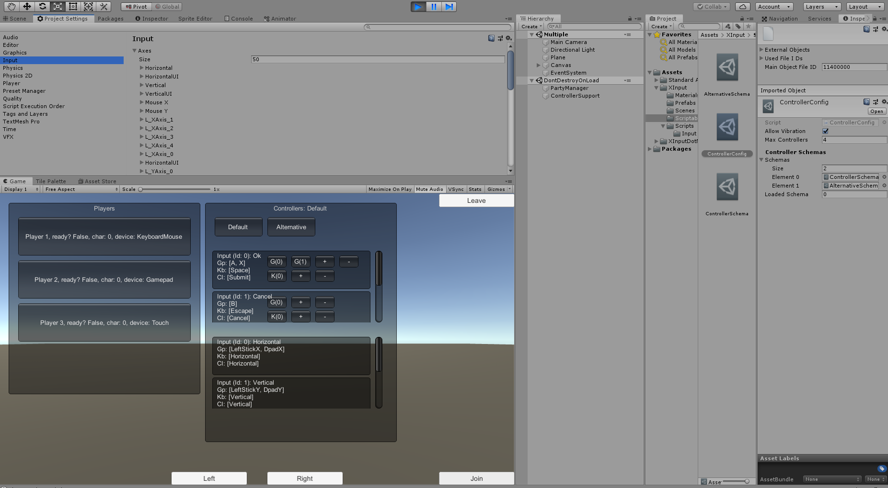

# Unity Multiple Input

This is an example of using a custom Input manager, it uses [XInputDotNet](https://github.com/speps/XInputDotNet) and Unity Standar Assets (CrossplatformInput).
You can read input from:
  - Mouse and Keyboard
  - Gamepad
  - Touch Input

### Features!

  - Party Manager (Create a party with several inputs)
  - Input Merge (Redefined Input manager)
  - Controller vibration (XInputDotNet)
  - Input Configutation files ***default:** XInput -> Scriptables -> ControllerConfig*
    - It should work as a customizable controll schema
    - Change controller config at runtime
    - Live remaping

### Input Merge

  - Define multiple Buttons and Axis, query them by id.
    - Query Dpad buttons is only available using XInputDotNet
  - On Generic Input and Keyboard it uses Unity Standar Input
  - Use the *#define* directives to enable/disable modes
    - **MOBILE_INPUT** enable touch input
    - **USE_GENERICINPUT** enable generic input (XInput will be disabled)

### To Do:

- Easier customization
  

Want to contribute? Great!